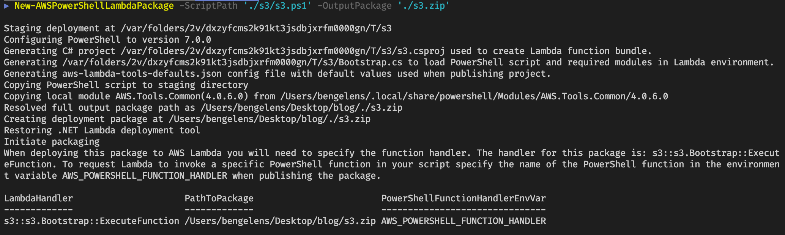
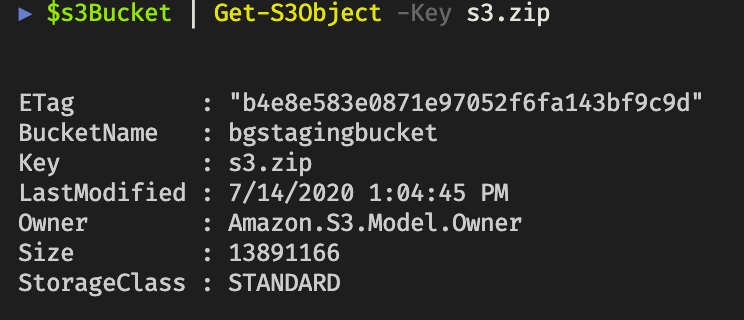
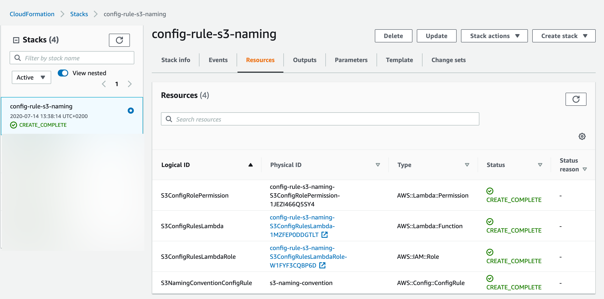
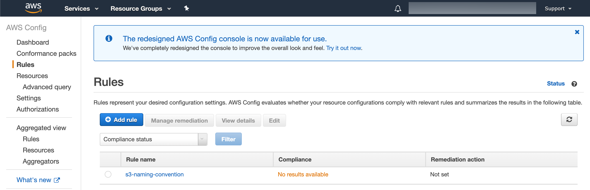
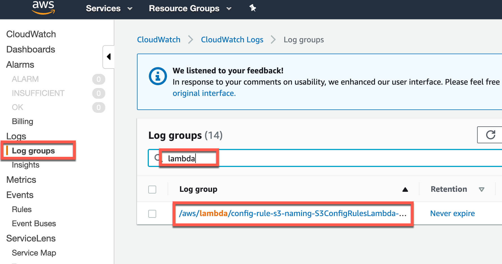
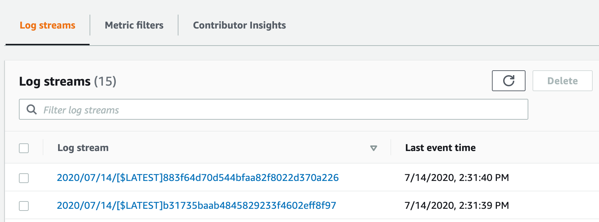
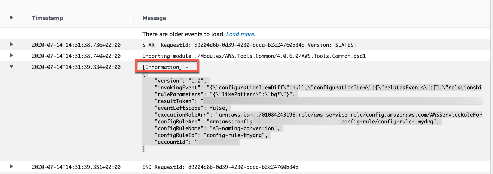
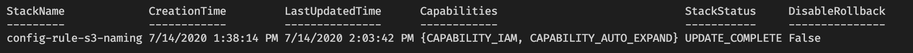
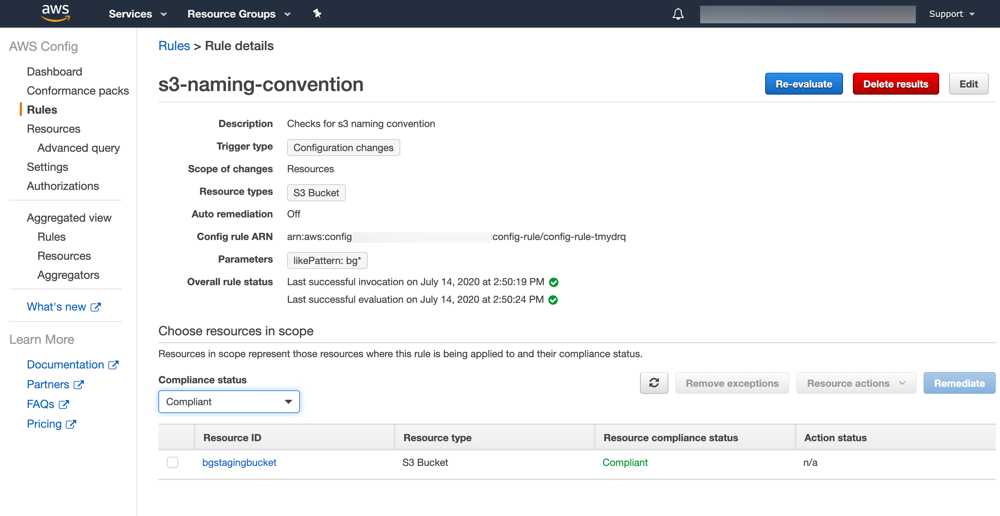
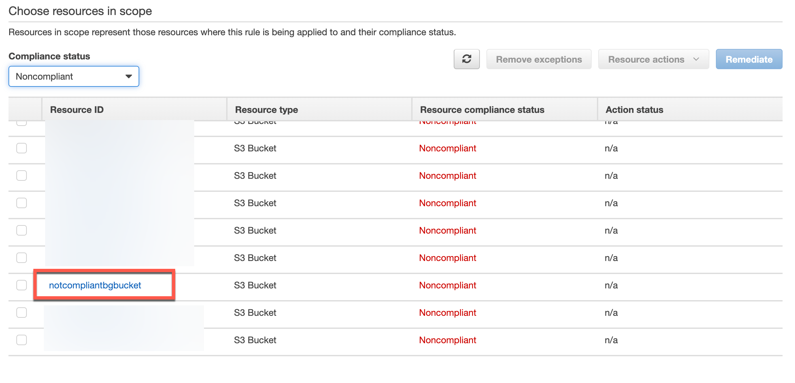

[AWS Config Rules](https://docs.aws.amazon.com/config/latest/developerguide/evaluate-config.html){:target="_blank"} allow you to evaluate the configuration settings of AWS resources during creation, update, deletions of such resources or on a schedule. They are used to audit resources for compliance with some defined policy. They don't prevent you from deploying in-compliant resources as this is the realm of [service control policies](https://docs.aws.amazon.com/organizations/latest/userguide/orgs_manage_policies_type-auth.html){:target="_blank"}.

A set of pre-defined [(Managed) config rules](https://docs.aws.amazon.com/config/latest/developerguide/managed-rules-by-aws-config.html){:target="_blank"} exist which can easily be used, but these inbox rules might not cover the policy that needs to be evaluated. For this, AWS offers you to [build your own custom config rules](https://docs.aws.amazon.com/config/latest/developerguide/evaluate-config_develop-rules_getting-started.html){:target="_blank"}.

A custom config rule is backed by a AWS Lambda function that contains the logic to handle the evaluation. [A lot of examples](https://github.com/awslabs/aws-config-rules/){:target="_blank"} can be found that use Java, Node or Python. There is also the [RDK](https://github.com/awslabs/aws-config-rdk){:target="_blank"} (Rule Development Kit) that can help you develop custom rules with Lambda functions in one of the, by the toolkit, supported languages (C#, Java, Node, Python). I was not able to find any example however to use [PowerShell for the Lambda function](https://docs.aws.amazon.com/lambda/latest/dg/lambda-powershell.html){:target="_blank"}.

In this blog I'm providing an example to have the Lambda function use PowerShell as the language to do the evaluation with a sample use case to evaluate S3 bucket's compliance with a naming convention.

<!--more-->

## Getting started

> In this blog post I'm assuming [AWS credentials](https://docs.aws.amazon.com/powershell/latest/userguide/specifying-your-aws-credentials.html){:target="_blank"} to already be setup. Also I'm using the [AWS.Tools](https://docs.aws.amazon.com/powershell/latest/userguide/pstools-welcome.html#pwsh_structure_pstools){:target="_blank"} PowerShell modules.

Before we start coding the Lambda function, we need all the AWS resources in place so we can actually see what we get as input to that function and how to process that data. The custom config rule will be deployed by using a [CloudFormation](https://aws.amazon.com/cloudformation/){:target="_blank"} template. The Lambda code will be staged in a S3 bucket so it can be referenced to during the Cloud Formation Stack deployment and updated if that code changes and the Stack gets updated.

> I'm assuming the config service is already configured. If not, please follow [this](https://docs.aws.amazon.com/config/latest/developerguide/gs-console.html){:target="_blank"} to setup the service.

### CloudFormation Template

I've prepared the following CloudFormation template:

```yml
AWSTemplateFormatVersion: "2010-09-09"
Transform: AWS::Serverless-2016-10-31

Description: Custom Config Rule S3
Parameters:
  SourceBucketName:
    Description: Bucket containing the lambda zip files
    Type: String

  NamingConventionPattern:
    Default: "*"
    Type: String

  PackageVersion:
    Type: String

Resources:
  S3ConfigRulesLambdaRole:
    Type: AWS::IAM::Role
    Properties:
      AssumeRolePolicyDocument:
        Version: 2012-10-17
        Statement:
          - Effect: Allow
            Principal:
              Service:
                - lambda.amazonaws.com
            Action:
              - sts:AssumeRole
      ManagedPolicyArns:
        - arn:aws:iam::aws:policy/service-role/AWSLambdaBasicExecutionRole
      Policies:
        - PolicyName: S3ConfigRulesLambdaRolePolicy
          PolicyDocument:
            Version: 2012-10-17
            Statement:
              - Effect: Allow
                Action:
                  - config:PutEvaluations
                Resource: "*"
                Sid: ConfigPutEvaluation

  S3ConfigRulesLambda:
    Type: AWS::Lambda::Function
    DependsOn: S3ConfigRulesLambdaRole
    Properties:
      Runtime: dotnetcore3.1
      Code:
        S3Bucket: !Ref SourceBucketName
        S3Key: s3.zip
        S3ObjectVersion: !Ref PackageVersion
      Role: !GetAtt
        - S3ConfigRulesLambdaRole
        - Arn
      Handler: s3::s3.Bootstrap::ExecuteFunction
      MemorySize: 512
      Timeout: 300

  S3ConfigRolePermission:
    Type: AWS::Lambda::Permission
    DependsOn: S3ConfigRulesLambda
    Properties:
      FunctionName: !GetAtt
        - S3ConfigRulesLambda
        - Arn
      Action: lambda:InvokeFunction
      Principal: config.amazonaws.com

  S3NamingConventionConfigRule:
    Type: AWS::Config::ConfigRule
    DependsOn: S3ConfigRolePermission
    Properties:
      ConfigRuleName: s3-naming-convention
      Description: Checks for s3 naming convention
      InputParameters:
        likePattern: !Ref NamingConventionPattern
      Scope:
        ComplianceResourceTypes:
          - "AWS::S3::Bucket"
      Source:
        Owner: CUSTOM_LAMBDA
        SourceDetails:
          - EventSource: aws.config
            MessageType: ConfigurationItemChangeNotification
        SourceIdentifier: !GetAtt
          - S3ConfigRulesLambda
          - Arn
```

The template will create the following resources:

- IAM Role: The Lambda function will execute as this role and will therefore have the permissions associated. In this case this permission is required: Allow config:PutEvaluations for all resources.
- Lambda Function: The Lambda function itself configured to have dotnet core 3.1 as the runtime (we can run PowerShell 7 with this runtime). The code is coming from a zip file that is uploaded to a S3 bucket which will be configured with [versioning](https://docs.aws.amazon.com/AmazonS3/latest/dev/Versioning.html){:target="_blank"} enabled (uploading a new version of the zip file will result in a new version, deploying the CloudFormation template again, will see the version update, triggering the Lambda to pull in the new code).
- Lambda Permission: The [permission](https://docs.aws.amazon.com/AWSCloudFormation/latest/UserGuide/aws-resource-lambda-permission.html){:target="_blank"} will allow the config service to trigger the Lambda Function.
- ConfigRule: The Config Rule is rule representing our policy. It is configured with source owner CUSTOM_LAMBDA signaling this is a custom config rule (managed config rule uses the same [CloudFormation resource](https://docs.aws.amazon.com/AWSCloudFormation/latest/UserGuide/aws-resource-config-configrule.html){:target="_blank"} where this property would be set to AWS). The input parameters allow us to have the Lambda function take in a value defined here, making the Lambda code more reusable. The config rule will evaluate based on change notifications (CRUD). The handler is hardcoded with an expected value (we'll see later), if you call your function script differently, the handler name will be different as well.

### Initial PowerShell Lambda code

To start coding PowerShell Lambda functions, the developer needs to:

- Install [dotnet core 3.1 SDK](https://dotnet.microsoft.com/download/dotnet-core/3.1){:target="_blank"}
- Install (and use) [PowerShell 7](https://docs.microsoft.com/en-us/powershell/scripting/install/installing-powershell?view=powershell-7#powershell-core){:target="_blank"}
- Install the [AWSLambdaPSCore](https://www.powershellgallery.com/packages/AWSLambdaPSCore/2.0.0.0){:target="_blank"} PowerShell module (`Install-Module AWSLambdaPSCore`). At the time of writing I'm using version 2.0.0.

Additionally for our function we need the following PowerShell modules installed:

- AWS.Tools.Common
- AWS.Tools.ConfigService

Additionally for interacting with AWS we need the following PowerShell modules:

- AWS.Tools.S3
- AWS.Tools.CloudFormation

At the time of writing I'm using version 4.0.6 of these modules.

From the AWSLambdaPSCore module, we'll use 2 cmdlets:

- `New-AWSPowerShellLambda`: (scaffolding the function code)
- `New-AWSPowerShellLambdaPackage`: Creating the zip file (handles the dotnet restore, etc.)

Let's create the function:

```powershell
New-AWSPowerShellLambda -Template Basic -ScriptName s3
```

The cmdlet will create a directory named s3 at the path currently set and in the directory it will create a ps1 file named s3.

The content of s3.ps1 will look like:

```powershell
# PowerShell script file to be executed as a AWS Lambda function. 
# 
# When executing in Lambda the following variables will be predefined.
#   $LambdaInput - A PSObject that contains the Lambda function input data.
#   $LambdaContext - An Amazon.Lambda.Core.ILambdaContext object that contains information about the currently running Lambda environment.
#
# The last item in the PowerShell pipeline will be returned as the result of the Lambda function.
#
# To include PowerShell modules with your Lambda function, like the AWS.Tools.S3 module, add a "#Requires" statement
# indicating the module and version. If using an AWS.Tools.* module the AWS.Tools.Common module is also required.

#Requires -Modules @{ModuleName='AWS.Tools.Common';ModuleVersion='4.0.6.0'}

# Uncomment to send the input event to CloudWatch Logs
# Write-Host (ConvertTo-Json -InputObject $LambdaInput -Compress -Depth 5)
```

The scaffolded ps1 file contains all the info required to start developing. One thing to know is that the Requires modules statements are used during packaging with the `New-AWSPowerShellLambdaPackage` cmdlet, to inject the PowerShell modules in the zip file. These modules have to be available (installed locally).

We'll modify the content of the ps1 file a little bit so it is clean and logs the LambdaInput variable to [CloudWatch](https://aws.amazon.com/cloudwatch/){:target="_blank"}.

```powershell
#Requires -Modules @{ModuleName='AWS.Tools.Common'; ModuleVersion='4.0.6.0'}

# log the input to cloudwatch
Write-Host -Object (ConvertTo-Json -InputObject $LambdaInput -Compress -Depth 5)
```

Now let's package the Lambda function:

```powershell
New-AWSPowerShellLambdaPackage -ScriptPath './s3/s3.ps1' -OutputPackage './s3.zip'
```



As you can see, the `New-AWSPowerShellLambdaPackage` cmdlet handles a couple of things for us.

> Note the LambdaHandler value. If this value is different from the CloudFormation template value, you'll need to change the value on the CloudFormation template.

### Creating the staging bucket

Let's create the staging bucket used by the CloudFormation Template to fetch the Lambda zip file from. The script below will create the bucket if it does not yet exists, enables versioning and setup some default best practices like encryption at rest and denial of public access.

```powershell
# set bucketname variable
$bucketName = 'bgstagingbucket'

# setup staging s3
$s3Bucket = Get-S3Bucket -BucketName $bucketName
$s3Bucket ??= New-S3Bucket -BucketName $bucketName -CannedACLName 'private' -ErrorAction Stop
Write-S3BucketVersioning -BucketName $bucketName -VersioningConfig_Status 'Enabled'

# Block public access for the bucket and objects
$s3PublicParams = @{
  BucketName                                          = $bucketName
  PublicAccessBlockConfiguration_BlockPublicAcl       = $true
  PublicAccessBlockConfiguration_BlockPublicPolicy    = $true
  PublicAccessBlockConfiguration_IgnorePublicAcl      = $true
  PublicAccessBlockConfiguration_RestrictPublicBucket = $true
}
Add-S3PublicAccessBlock @s3PublicParams

# Ensure Encryption
$s3EncryptionParams = @{
  BucketName                                                 = $bucketName
  ServerSideEncryptionConfiguration_ServerSideEncryptionRule = @{
    ServerSideEncryptionByDefault = @{
      ServerSideEncryptionAlgorithm = 'AES256'
    }
  }
}
Set-S3BucketEncryption @s3EncryptionParams
```

Now we have the staging bucket setup, let's upload the s3.zip file created earlier.

```powershell
$s3Bucket | Write-S3Object -File './s3.zip' -Force
$s3Bucket | Get-S3Object -Key s3.zip
```



### Deploying the initial config rule

To deploy the config rule we need to fetch the current s3 object version first:

```powershell
$version = (Get-S3Version -BucketName $bucketName -Prefix 's3.zip').Versions.Where{ $_.IsLatest }[0].VersionId
```

Now we have the version, we can deploy the CloudFormation template (note that I saved the above template to disk first):

```powershell
# explicit import to make types available as we cannot rely on autoloading due to sequence of script
Import-Module -Name 'AWS.Tools.CloudFormation'

# make a list of parameter values for cloud formation deployment
$cfnParams = [System.Collections.Generic.List[Amazon.CloudFormation.Model.Parameter]]::new()

# the source bucket name
$cfnParams.Add([Amazon.CloudFormation.Model.Parameter]@{
  ParameterKey   = 'SourceBucketName'
  ParameterValue = $bucketName
})

# the naming convention buckets should adhere to. In my case prefixed with bg is allowed
$cfnParams.Add([Amazon.CloudFormation.Model.Parameter]@{
  ParameterKey   = 'NamingConventionPattern'
  ParameterValue = 'bg*'
})

# the version fetched earlier
$cfnParams.Add([Amazon.CloudFormation.Model.Parameter]@{
  ParameterKey   = 'PackageVersion'
  ParameterValue = $version
})

$deployArgs = @{
  StackName   = "config-rule-s3-naming"
  Parameter   = $cfnParams
  Capability  = 'CAPABILITY_IAM', 'CAPABILITY_AUTO_EXPAND'
  TemplateBody = (Get-Content -Path ./configrule.yaml -Raw)
}

# deploy cloudformation template and wait for maximum 15 minutes
New-CFNStack @deployArgs | Wait-CFNStack -Timeout (15 * 60)
```

> Note the capabilities set are needed for CloudFormation to be allowed to handle certain tasks. For more info see the [API documention](https://docs.aws.amazon.com/AWSCloudFormation/latest/APIReference/API_CreateStack.html){:target="_blank"}

Investigating the deployed stack in the console:



Navigating to the config service, we see the newly deployed custom config rule with No results available.



## Iterating the config rule

Now everything is in place, we need to develop the logic for the Lambda function. To do this, we'll need some logging information. Let's create an s3 bucket that violates our policy and one that complies with it. Note that I set the policy to allow s3 buckets with `bg` as the prefix (see above). As my stating S3 bucket is already compliant, we'll need a S3 bucket that is not compliant to see both results.

### Creating in-compliant S3 bucket

```powershell
New-S3Bucket -BucketName 'notcompliantbgbucket'
```

### Evaluate logging

Let's start a manually triggered evaluation (this is handy when developing iteratively):

```powershell
Start-CFGConfigRulesEvaluation -ConfigRuleName 's3-naming-convention'
```

In the console, navigate to the CloudWatch service, select `log groups` and search for the log group associated with your Lambda function.



Once you click on the log group, you'll see different log streams. Just click the most recent one:



Inspect one of the log messages with the [Information] header. Now we can see what information is available as part of the LambdaInput.



### Adjusting the Lambda code

Now we know what is being send, we can adjust the Lambda code so it will evaluate what we desire and is able to report back to the config service.

```powershell
#Requires -Modules @{ModuleName='AWS.Tools.Common'; ModuleVersion='4.0.6.0'}
#Requires -Modules @{ModuleName='AWS.Tools.ConfigService'; ModuleVersion='4.0.6.0'}

# log the input to cloudwatch
Write-Host -Object (ConvertTo-Json -InputObject $LambdaInput -Compress -Depth 5)

$invokingEventDeserialized = $LambdaInput.invokingEvent | ConvertFrom-Json -Depth 20
$bucketName = $invokingEventDeserialized.configurationItem.resourceName
$ruleParameters = $LambdaInput.ruleParameters | ConvertFrom-Json
$likePattern = $ruleParameters.likePattern

Write-Host -Object "Evaluating BucketName: $bucketName against naming pattern: $likePattern"

$complianceType = if ($LambdaInput.eventLeftScope) {
  'NOT_APPLICABLE'
} elseif ($bucketName -notlike $likePattern) {
  'NON_COMPLIANT'
} else {
  'COMPLIANT'
}

$evalResult = [Amazon.ConfigService.Model.Evaluation]@{
  ComplianceResourceId   = $invokingEventDeserialized.configurationItem.resourceId
  ComplianceResourceType = $invokingEventDeserialized.configurationItem.resourceType
  ComplianceType         = $complianceType
  OrderingTimestamp      = [datetime]::UtcNow
}

Write-Host -Object "EvalResult:`n$($evalResult | ConvertTo-Json)"
Write-CFGEvaluation -Evaluation $evalResult -ResultToken $LambdaInput.resultToken
```

A few things to note:

- The AWS.Tools.ConfigService Module has a cmdlet `Write-CFGEvaluation` which is capable of handling the reporting to the config service (no need to write your own). By including it as a Required Module, the `New-AWSPowerShellLambdaPackage` will includes it in the package).
- When `eventLeftScope` is true, a resource was deleted. No need to evaluate a deleted resource.

As you can see, the end result is pretty lean which is one of the reasons I think PowerShell should be used a little bit more for Custom Config Rules.

Let's republish the Lambda function code:

Generate new zip file:

```powershell
New-AWSPowerShellLambdaPackage -ScriptPath './s3/s3.ps1' -OutputPackage './s3.zip'
$s3Bucket | Write-S3Object -File './s3.zip' -Force
```

Update CloudFormation Stack:

```powershell
$version = (Get-S3Version -BucketName $bucketName -Prefix 's3.zip').Versions.Where{ $_.IsLatest }[0].VersionId

$cfnParams = [System.Collections.Generic.List[Amazon.CloudFormation.Model.Parameter]]::new()

# the source bucket name
$cfnParams.Add([Amazon.CloudFormation.Model.Parameter]@{
  ParameterKey   = 'SourceBucketName'
  ParameterValue = $bucketName
})

# the naming convention buckets should adhere to. In my case prefixed with bg is allowed
$cfnParams.Add([Amazon.CloudFormation.Model.Parameter]@{
  ParameterKey   = 'NamingConventionPattern'
  ParameterValue = 'bg*'
})

# the version fetched earlier
$cfnParams.Add([Amazon.CloudFormation.Model.Parameter]@{
  ParameterKey   = 'PackageVersion'
  ParameterValue = $version
})

$deployArgs = @{
  StackName   = "config-rule-s3-naming"
  Parameter   = $cfnParams
  Capability  = 'CAPABILITY_IAM', 'CAPABILITY_AUTO_EXPAND'
  TemplateBody = (Get-Content -Path ./configrule.yaml -Raw)
}

try {
  Update-CFNStack @deployArgs -Force | Wait-CFNStack -Timeout (15 * 60)
} catch {
  if ($_.Exception.Message -eq 'No updates are to be performed.') {
    Write-Host -Object 'Stack exist, no updates required'
  } else {
    throw $_
  }
}
```



## End result

Now everything is in place, let's trigger a re-evaluation:

```powershell
Start-CFGConfigRulesEvaluation -ConfigRuleName 's3-naming-convention'
```

In the console, we can navigate to the config service. Go to the rules, select the `s3-naming-convention` rule and check for resources that are compliant:



and noncompliant:


