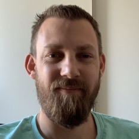

It has been a while since I published anything here. It has been a while since I spoke at conferences / user groups. What is going one with me?

Well mostly the same as with everybody else of course. The pandemic hasn't been good for my community life. No more traveling, no more in person conferences and user groups. It kind of put a full stop on my contributions. But this is not the whole story.

<!--more-->

## The personal bits

I'm not one for sharing much about my private life. I'm all about technology as this is the main thing that connects me with other people and makes me happy. But sharing only this aspect of my life doesn't reflect the whole person and therefore this time, I'm making a tiny exception. So what has been going on besides growing a beard?

I experienced some personal tragedy when I lost my mother in may 2020. She died of complications of something not covid related but unfortunately it did happen during the early days of the pandemic. It tainted her last days being hospitalized, not able to see all of her children at the same time due to visiting restrictions. When she draw her last breath, the hospital kindly made an exception and allowed all of us to be at her side. After my mothers passing, me and my brothers arranged the funeral and I acted as the family proxy for all affairs. As you can imagine, this life experience was pretty hard to deal with.

We decided to buy a new house. At the time of writing it is still under construction and we are looking forward to get the keys somewhere at the end of this year (2022).

We are really looking forward to moving over! In the mean time, we sold our previous house and moved into a temporary appartement (the 4 of us) suited for 3 people. It is a one of a kind appartement as it is build inside of a church, which is awesome but also very noisy and a bit cramped for the 4 of us. I work, sleep, live and cook in the same room. Luckily both of my children both have their own rooms so when they are done with us, they can at least have a bit of privacy :)

Looking forward to the new house, I've not made any plans for visiting / speaking at conferences. As soon as the keys are in our possession, we need to make the house ready asap and move over.

## The professional bits

Professionally a lot has changed. I used to be a consultant doing mainly automation with PowerShell, infrastructure as code, desired state configuration, that sort of thing. I used a Windows laptop but moved to a MacBook. I worked with VMs but moved to containers. From containers I started working on Kubernetes a lot, more and more open source tooling. Pulumi, Helm, you name it.

Every now and then I contributed some code to some project using a variety of coding languages and this has been a bit of an eye opener for me. I always thought my passion was complex problem solving and integration from a infrastructure perspective, but really what I like to do most, is to code!

My employer, [Wortell](https://www.wortell.nl/){:target="_blank"} gave me the opportunity to work part time on our MDR (Managed Detection and Response) service. Writing code for this project from a business value perspective has been great and I learned tons of new things. Since this summer I have moved into the team full time and am now dedicating all time to programming! Learning new things every day, new patterns, new techniques, new tools, etc. etc. In short, I'm having a blast!

This transition does mean I'm kinda moving away from my goto contribution area. I still use PowerShell everyday (can't live / work without it) but my professional interests have moved into other directions. As my experience grows, I'm looking forward to connecting with the community again and sharing knowledge. Hopefully sooner than later as I miss being connected and feeling being part of a community.
